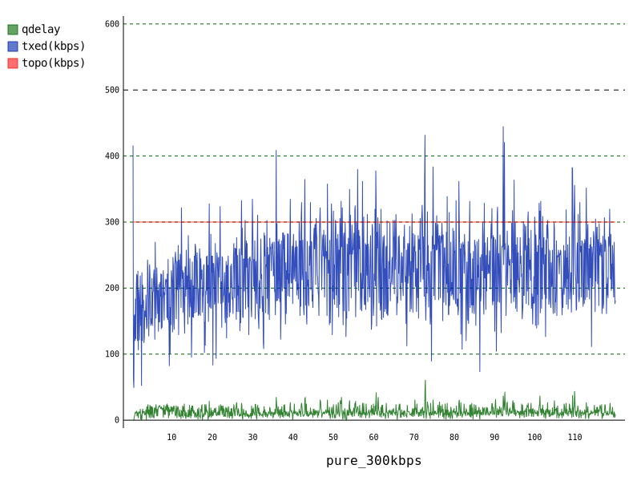
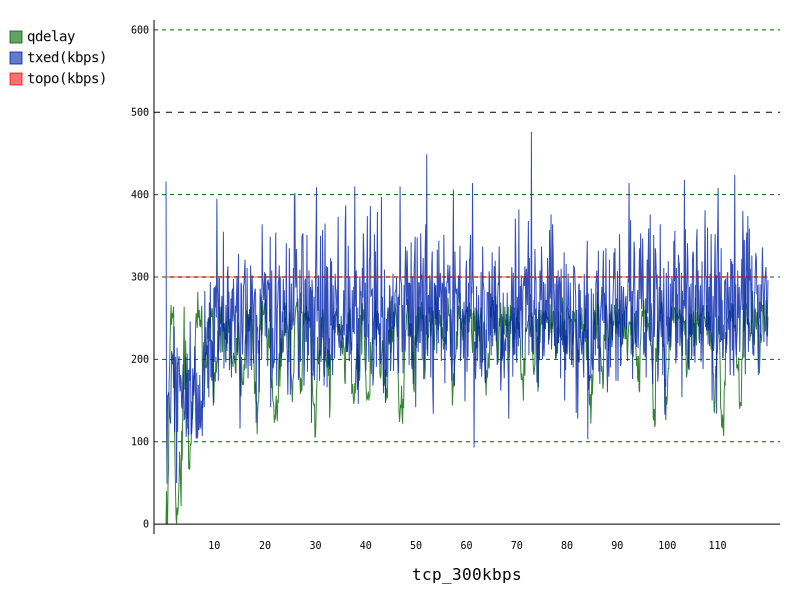
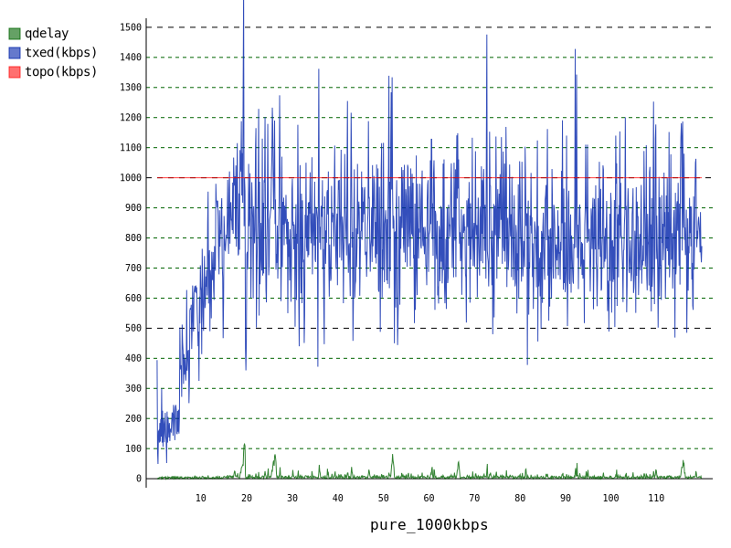
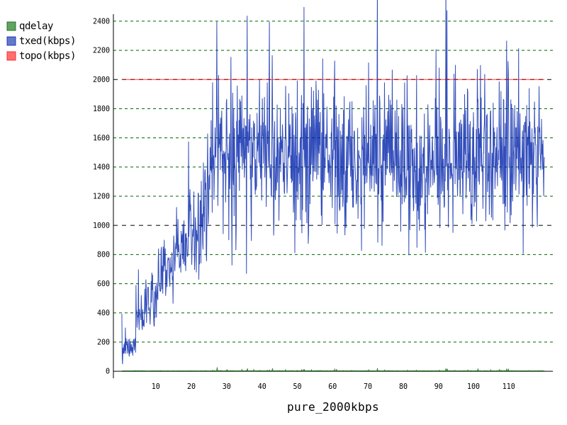
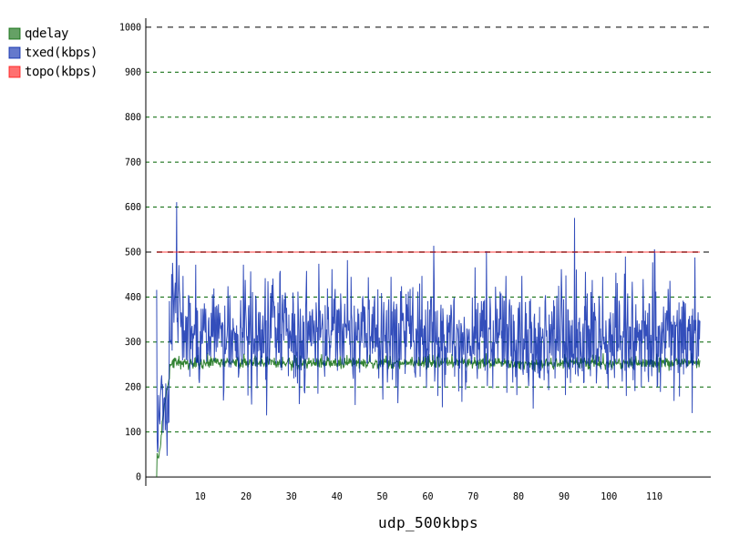
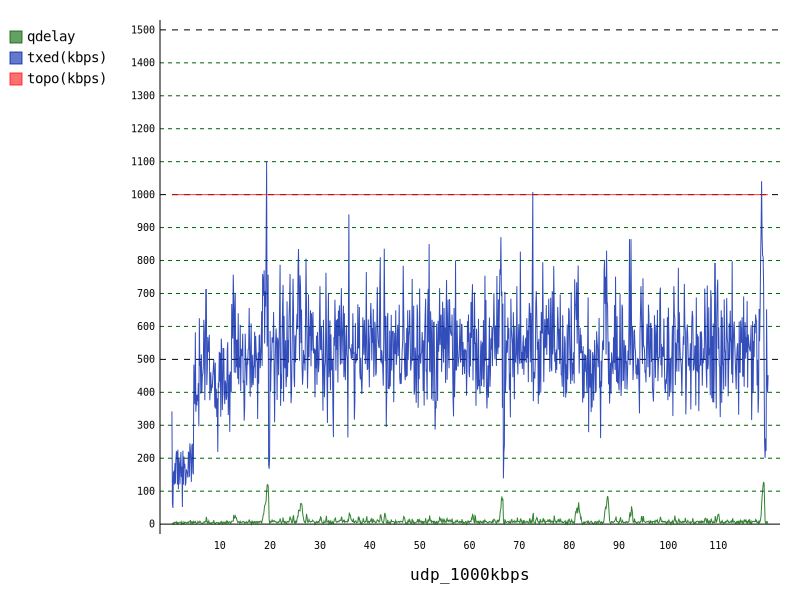

Example to check basic performance of the CCFS
============

Introduction
-------------
Using rmcat-example, draw a graph of qdelay and sending bitrate under the limited bandwidth under the environment below.

* Codec output range: 150 kbps ~ 1.5 Mbps
* Network BW: 300kbps, 500kbps, 1Mbps, 2Mbps
* Q size: 300 msec
* Test runtime: 120sec

* Test scenario: pure CCFS, CCFS + 1TCP, CCFS + 1UDP
* The UDP cross traffic send rate = 375 kbps

Before running rmcat-example for ccfs, check ns log level is proper or not.
Simply you can use tools/set_nslog file.

`source set_nslog`

run-ccfs-vpara.py
-------------
Current Directory: src/ns3-rmcat/tools/example-ccfs

`python run-ccfs-vpara.py`

This runs rmcat-example with various parameters but the algorithm is always CCFS.

After running the rmcat-example, 
ccfs-parser.py will be run with the ccfs log file, generated from the rmcat-example.

And then,
ccfs-plot.py will be run with the csv file, generated from the ccfs-parser.

ccfs-parser.py
-------------

`python ccfs-parser.py ${input-ccfs-log-file} ${output-csv-file}`

ccfs-plot.py
-------------

`python ccfs-plot.py ${title} ${output-file-without-extention} ${input-csv-file} ${bottleneck-bw-kbps}`

ccfs-results
-------------
After finishing all examples, the graph will be updated.

Graph 
* Red: BW limitation
* Blue: Sending Bitrate
* Green: Q delay
* X Axis: Test run time

| BW\Trf | CCFS | +TCP |
| ---    | --- | --- |
| |  |  |
| 300kbps ||   |
| 500kbps ||   |
| 1000kbps ||   |
| 2000kbps ||   |

| BW\Trf | CCFS | +UDP |
| ---    | --- | --- |
| |  |  |
| 300kbps ||   |
| 500kbps ||   |
| 1000kbps ||   |
| 2000kbps ||   |

